# Встановлення Postgres на Windows

### Заходимо на офіційний сайт [Postgres](https://www.postgresql.org/):

### Заважнажуємо останню доступну вам версію під свою ОС та чекаємо, поки вона завантажиться:

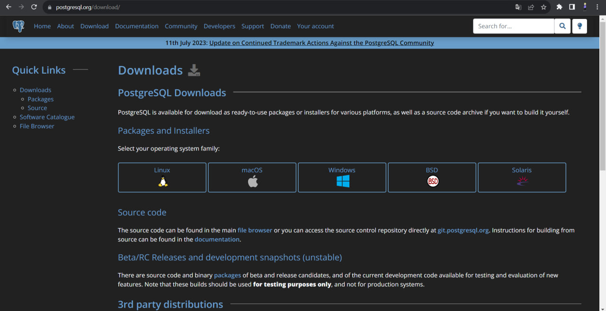

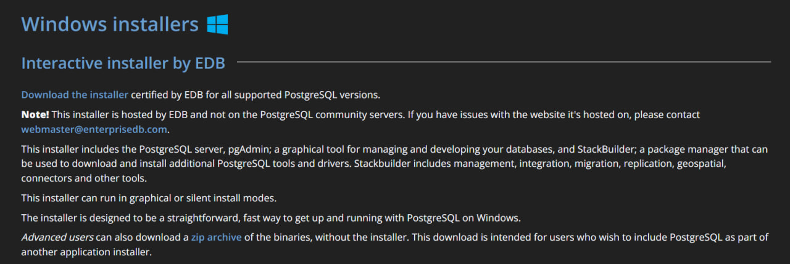

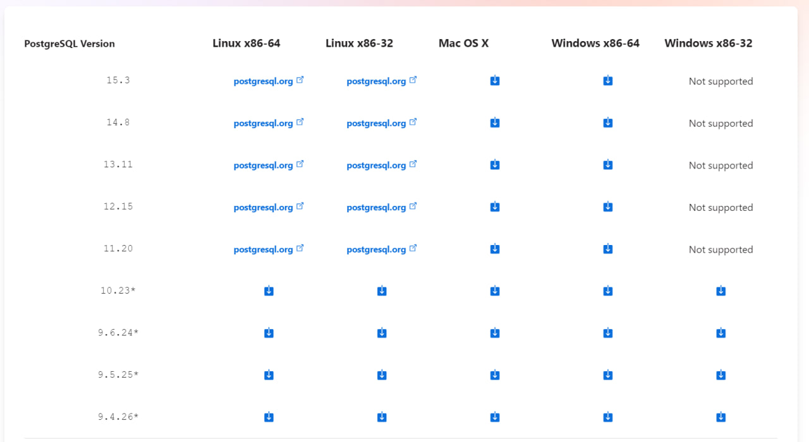

### Запускаємо сетап:

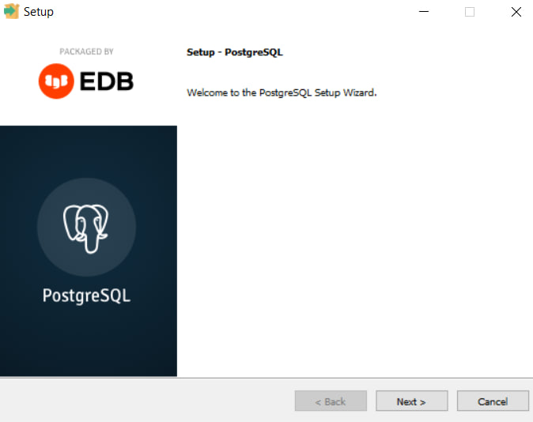

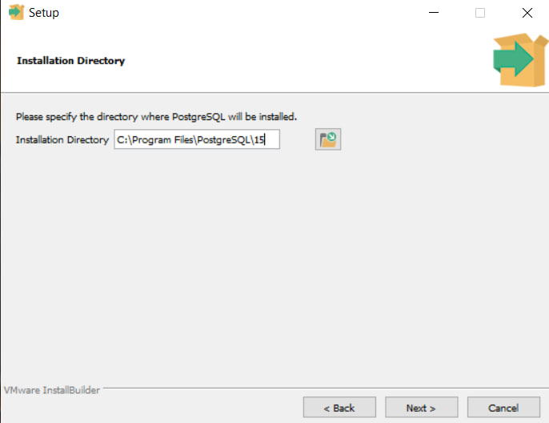

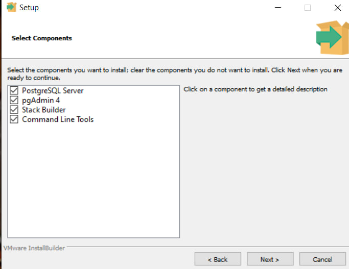

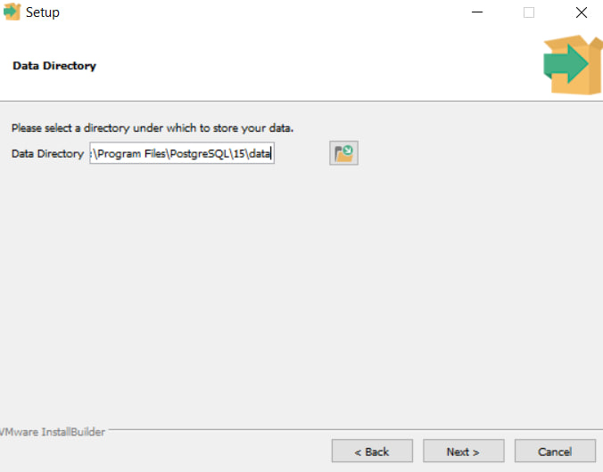

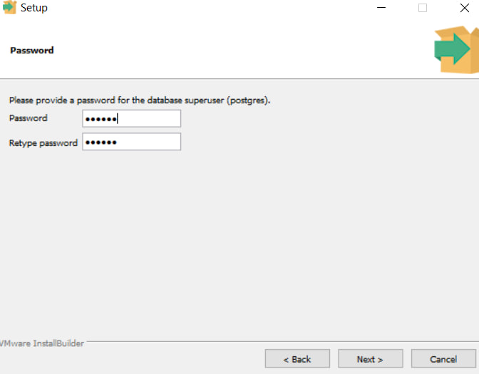

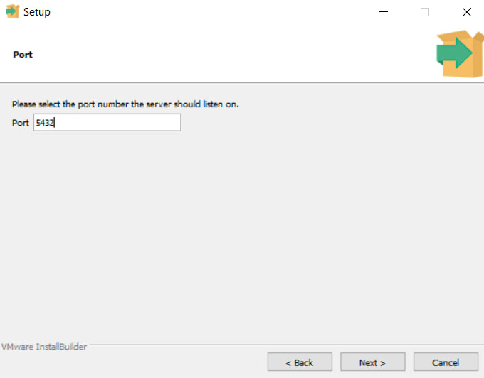

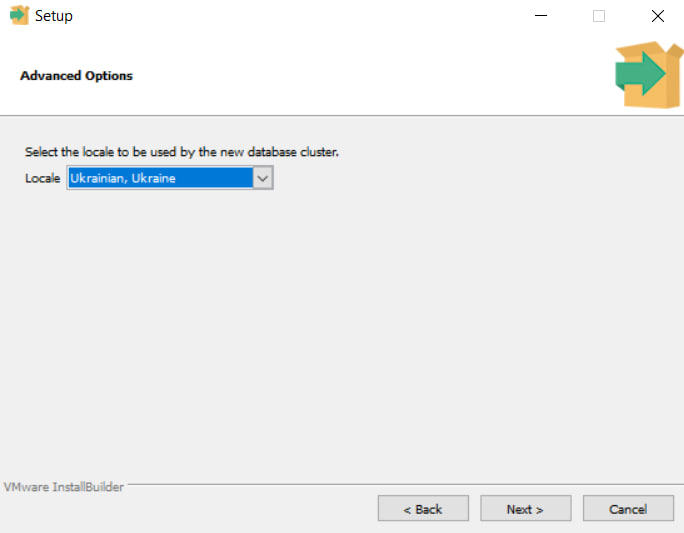

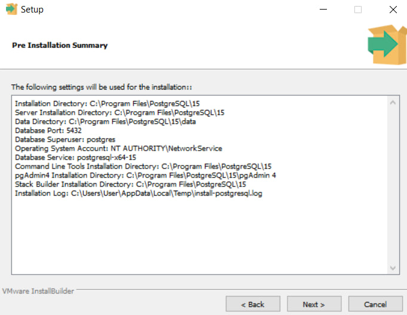

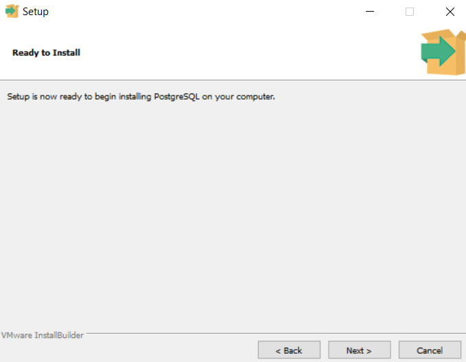

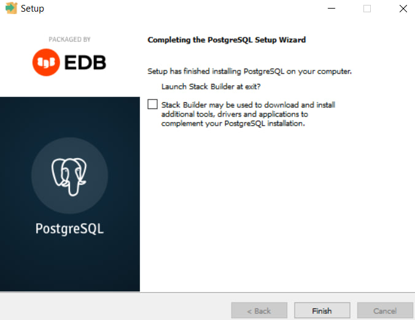

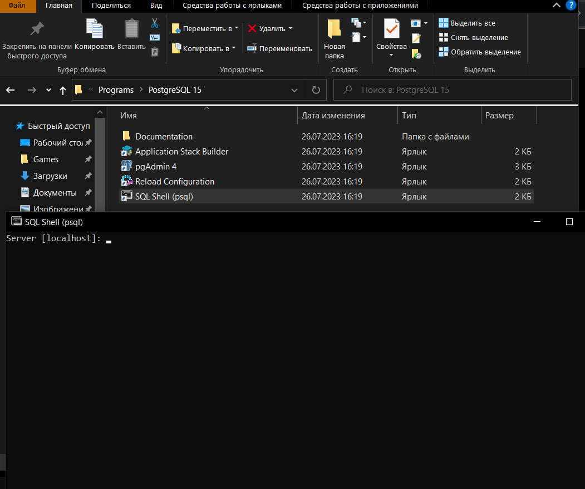
